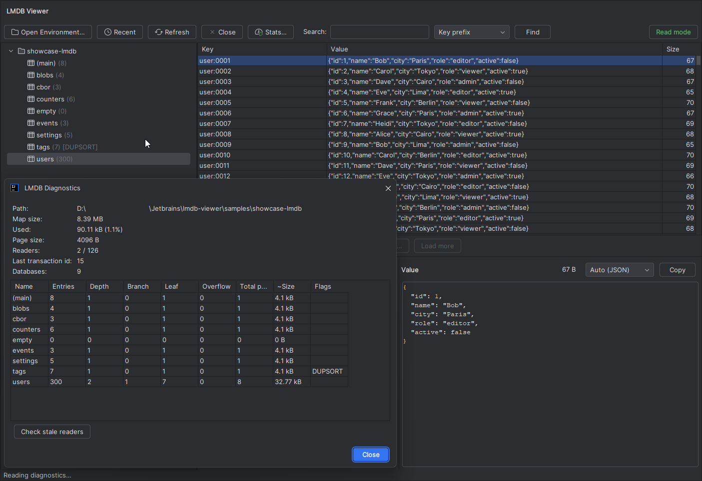

# LMDB Viewer

An IntelliJ IDEA plugin to **browse LMDB (Lightning Memory-Mapped Database)** data stores directly
inside the IDE. Read-only and safe by default, with an opt-in **edit mode** (add / edit value /
delete) behind an explicit per-environment toggle.

It opens an LMDB environment (a `data.mdb` directory or single-file `*.mdb` store), browses named
sub-databases (DBIs), pages large entry sets lazily, and decodes opaque byte keys/values
(hex, UTF-8/ASCII, JSON, CBOR, integers) through a pluggable decoder extension point.



## Build & run

Requires **JDK 21**. Targets IntelliJ **2024.2+** (`since-build 242`).

```bash
./gradlew runIde          # launch a sandbox IDE with the plugin
./gradlew test            # decoder + access-layer tests
./gradlew buildPlugin     # build/distributions/*.zip for install-from-disk
./gradlew verifyPlugin    # JetBrains Plugin Verifier (needs network; run before release)
```

## Documentation

Full documentation is an **Open Knowledge Format (OKF v0.1)** bundle under [`docs/`](docs/index.md):

- [Overview](docs/overview.md) · [Features](docs/features.md) · [LMDB concepts](docs/lmdb-concepts.md)
- [Architecture](docs/architecture/index.md) — [access](docs/architecture/access-layer.md),
  [decode](docs/architecture/decode-layer.md), [ui](docs/architecture/ui-layer.md) layers,
  [native-loading gotcha](docs/architecture/native-loading.md),
  [decoder extension point](docs/architecture/decoder-extension-point.md)
- [Build, run & test](docs/operations/build-run-test.md) ·
  [Conventions](docs/conventions.md) · [Roadmap](docs/roadmap.md)

For contributors/agents, [CLAUDE.md](CLAUDE.md) is the index into the bundle.

## License

[Apache License 2.0](LICENSE). Copyright © 2026 ShadeTeam.
